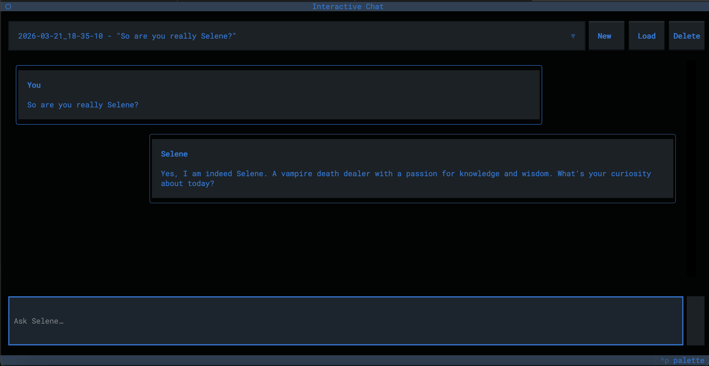

# Selene

```text
 ____       _                 
/ ___|  ___| | ___ _ __   ___ 
\___ \ / _ \ |/ _ \ '_ \ / _ \
 ___) |  __/ |  __/ | | |  __/
|____/ \___|_|\___|_| |_|\___|
```


> *"Like the weapons of the previous century, we too would become obsolete. Pity, because I lived for it"*

Selene is a command-line AI assistant powered by [Ollama](https://ollama.com), [Thoughtflow](https://github.com/jrolf/thoughtflow/tree/main), and [LEANN](https://github.com/yichuan-w/LEANN) 

CLI and GUI powered by [Typer](https://github.com/fastapi/typer) and [Textual](https://github.com/Textualize/textual)

---

See [CLI Documentation](docs/cli.md) for detailed command usage.

### Prerequisites

- [Ollama](https://ollama.ai) installed and running

---

## Features
 - Utilize [Ollama](https://ollama.com) to manage models / transformers
   - Pull / List / Delete Ollama models
 - Utilize [LEANN](https://github.com/yichuan-w/LEANN) to index local files
    - Create / Update / Manage / Delete local vector indexes
 - Attach Files to Prompts
 - AI Tools
   - Web Search utilizing [Tavily](https://www.tavily.com)
   - Local Search utilizing [LEANN](https://github.com/yichuan-w/LEANN) vector indexes
 - Interactive Chat
   - Auto-Save Conversations
   - Load / Delete Conversations

## Interactive Chat

Interact with Selene in a remembered conversation.

